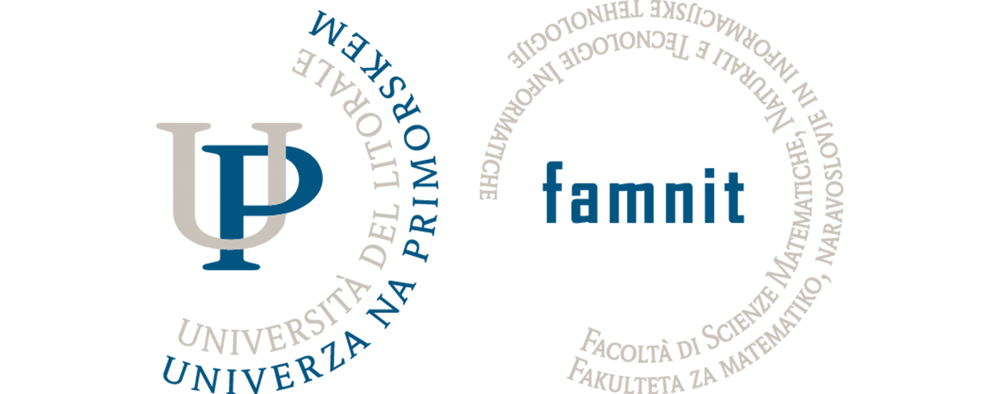

# UP FAMNIT - Osnove Strojenega Učenja In Podatkovnega Rudarjenja - Projekt - 2024/2025

Professor: izr. prof. Branko Kavšek

Practice assistant: Domen Vake

## Intro

The repository serves as a personal archive of all code written during the course of OSUPR at UP FAMNIT. The code is written in Java and R, using VS Code and Intellij Idea as the IDEs.

**!!! Code in this repository is fully working - it’s only shared !!! after !!! submitting my project. Use or copy at your risk !!!**

**FOR "I AM THE SMARTEST IDIOT" CLASSMATE(S): this IS NOT a free ride for your project. When you get caught using my gigabrain, I'll proudly wave this repository, timestamps, hidden indicators, as proof of my originality while you get a front-row seat to your ethics hearing. Consider yourself warned 💅**

## About Project

This is a project where I attempt to create AI application that could perform basic tasks outlined in [Nacrt.pdf](Nacrt.pdf). The AI was built using machine learning techniques, with a focus on training them to recognize patterns and provide responses based on user input. The project aimed to explore the fundamentals of AI, including data preprocessing, model training, and evaluation, while applying theoretical knowledge to practical systems.

<!---
## Folder structure

1. Classification based on class type:
    - `class` - Contains code from lectures, that was written during the class
    - `practice` - Contains code from lab practice
    - `HW` - Contains homeworks

2. Organised code by dates (yyyy-mm-dd).

3. Optionally organised further to maintain a clean structure.
--->

## Contributions

This is a personal space, thus contributions or pull requests will not be accepted.

Template by [Matic Boncina](https://github.com/maticboncina).
